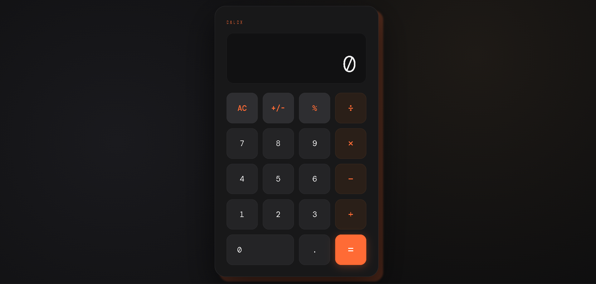

# Calculator App

A modern responsive calculator built using HTML, CSS, and JavaScript.

## Features
- Basic arithmetic operations
- Responsive UI
- Clean dark theme
- DOM manipulation
- Event handling

## Skills Used
- HTML5
- CSS3
- JavaScript
- DOM Manipulation
- Functions
- Event Handling
- Responsive Design

## Screenshot

## Live Demo
Coming Soon

## Author
Prabhav